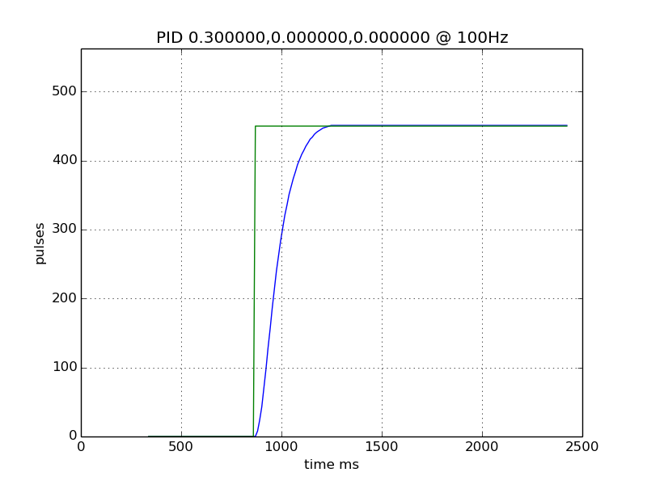
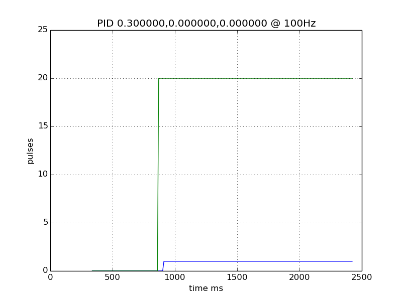
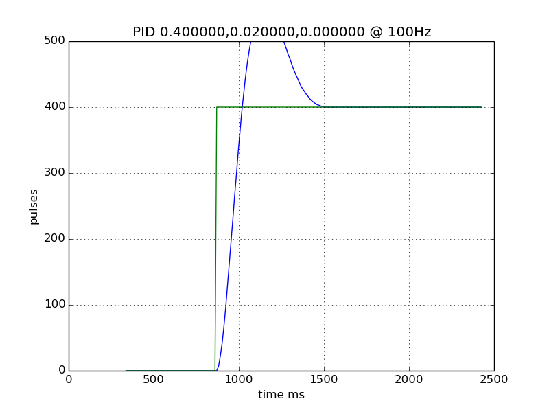
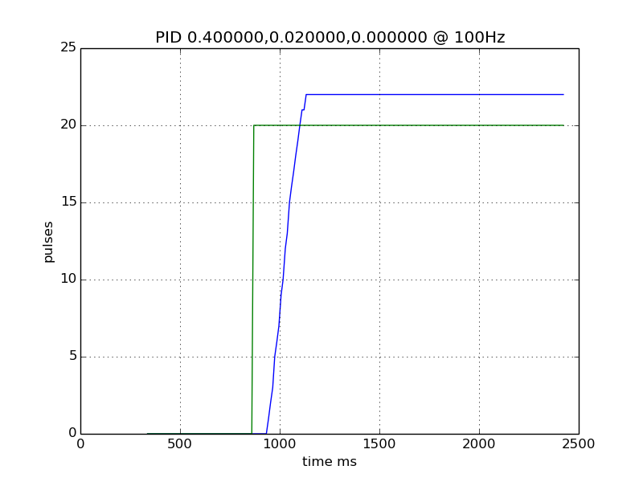
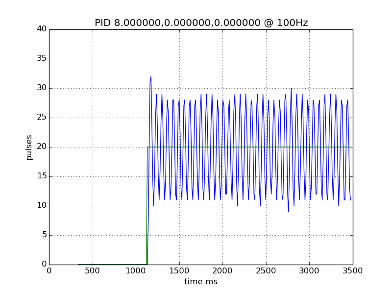
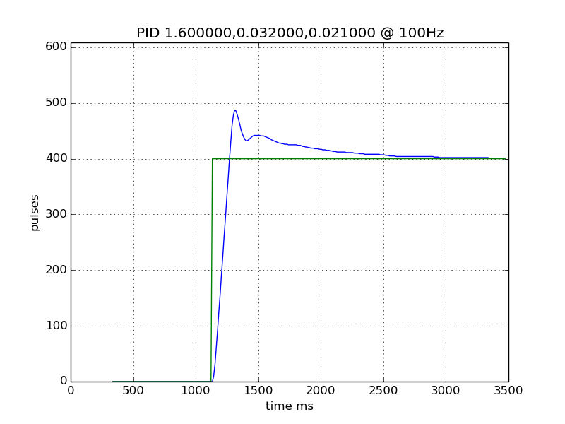
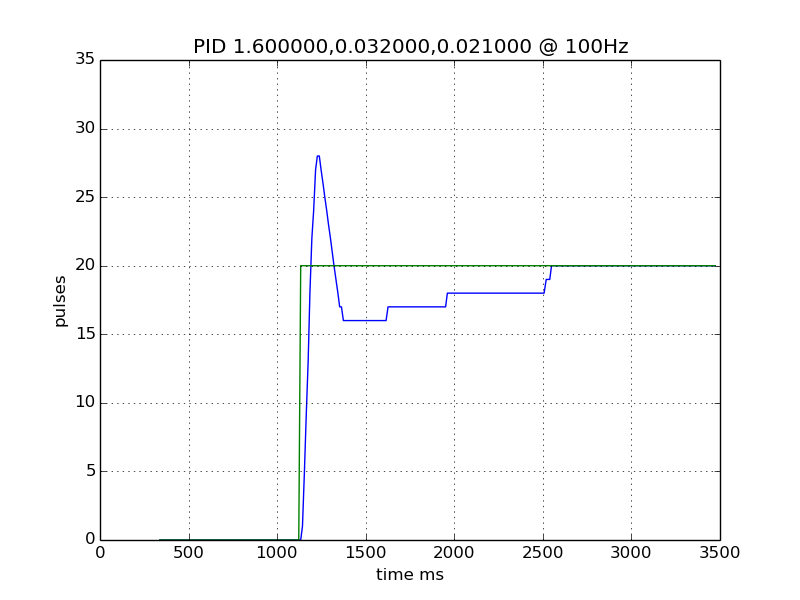
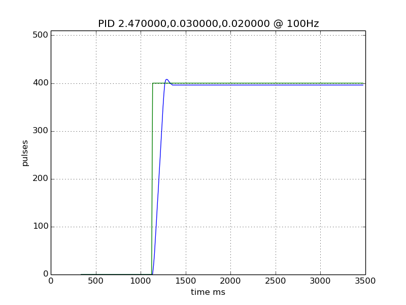
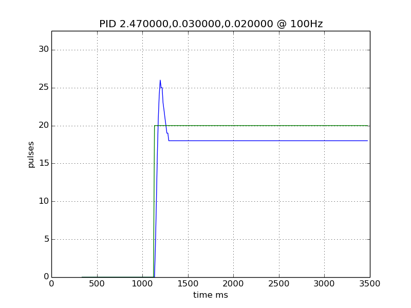

# Servo testing

# Zeigler-Nichols method

https://en.wikipedia.org/wiki/Ziegler%E2%80%93Nichols_method

* ku = 8
* tu = 64 ms

So for no overshoot:

* p = 4.8
* i = 0.032
* d = 0.008

## Alternative PID alg  + tuning while loaded

* ku = 7.5
* tu = 61 ms

* p = 2.47
* i = 0.03
* d = 0.02

## BOM

* 12v DC brushed motor with 80:1 gearbox
* 400 ppr encoder (1600 cpr) mounted on output of motor's gearbox
* L298 H bridge
* ATMEGA328p

## Firmware

* PID loop running at 100Hz
* PWM running at 32kHz

# PSU

* 12v, current limited at 0.5A.
* Typical draw while static is 0.1A
* PSU is not going switching to constant current while moving.
